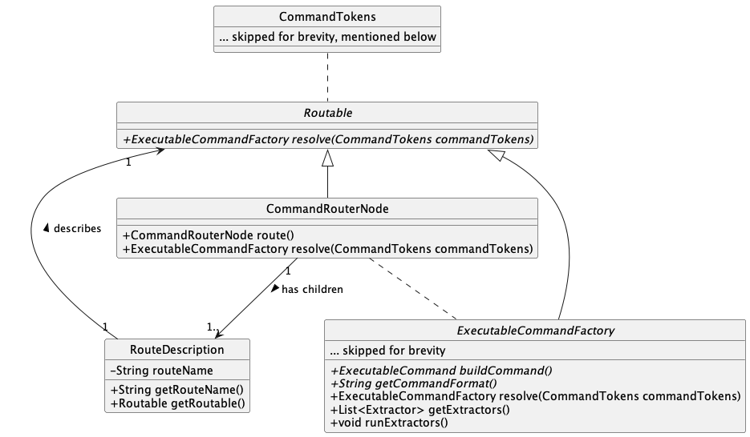
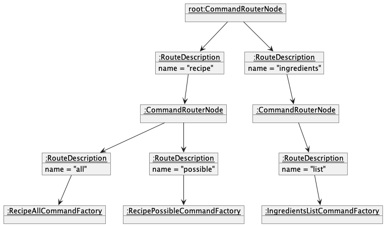
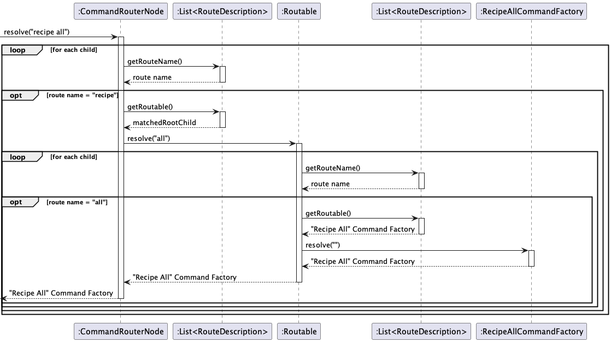

# EthanYidong - Project Portfolio Page

## Overview

Meal Companion is a recipe book which allows you to search
by the ingredients you already have so that you can easily find recipes you can make.

### Summary of Contributions
[Contributed Code](https://nus-cs2113-ay2223s2.github.io/tp-dashboard/?search=ethanyidong&breakdown=true)

#### Enhancements
- Overall command parsing structure
- Overall application architecture
- Ingredient and recipe database setup
  - Recipe cooking and preparation time
- Ingredients list command
- Ingredients search command
- Allergens command

#### UG
- Front Matter: extended value proposition
- Command syntax (done inside draft, copied over to GitHub)

#### DG
- Describe how routing is implemented and why
  - Routing class diagram
  - Routing sequence diagram

### Contributions to Team-Based Tasks
- Overall command parsing structure 
- Overall application architecture
- Created v1.0 Release
- Setup assertions for Gradle

#### Reviewing/Mentoring Contributions
- Assisted Jia Chen in setting up his local repository workflow
- Wrote example code to help teammates understand how to utilize the command framework setup by me

#### Contributions Beyond the Project Team
- Found a bug which caused a crash in [Budget Buddy](https://github.com/AY2223S2-CS2113-W15-3/tp)

# Contributions to the Developer Guide (Extracts)

The system of `Routable` classes is built to allow for a composable setup of commands and subcommands.

Developers are able to build a "routing tree" by nesting `CommandRouterNode`s together, allowing for command matching
to be done in a robust and extensible way. This architecture was chosen because our commands are designed to have common
prefixes, such as the "recipe all" and "recipe possible" commands.

Therefore, we need to standardize the way we parse
the command in such a way that we do not have to worry about match priority or ordering, as we would if we
were to implement this with simple if-else or switch statements.

- The "routing tree" is built around the concept of the `Routable` interface, with a `CommandRouterNode` at the root.
- Classes which implement `Routable` have a `resolve` function which will map a `CommandTokens` object to an
  `ExecutableCommandFactory`.
- Routing is done in a depth-first fashion via recursive calls to `resolve`, until an
  endpoint is reached at which point the corresponding `ExecutableCommandFactory` is returned.

This is an object diagram representing a portion of the routing tree for MealCompanion, supporting the "recipe all",
"recipe possible", and "ingredient list" commands.

The sequence diagram below illustrates the process for resolving the "recipe all" command.

# Contributions to the User Guide (Extracts)

## Who is this for?
This document is for busy students and working adults who want to begin cooking with Meal Companion. If you want to see how Meal Companion can change your food habits to support a sustainable and healthy lifestyle, read on!

## Why Meal Companion?

Cooking is a committment. It's hard to buy exactly the right amount of ingredients especially when you're cooking for one, and even if you can stomach eating the same recipe every day for a week, the ingredients run out at different times! Most people, when faced with this problem, will simply throw out whatever goes bad and go back to their daily trips to canteens, hawkers, or resturaunts. And, that's where Meal Companion comes in! Here's how we improve upon the experience of commonly used recipe sources.

### Versus Traditional Recipe Books

Let's be real here, very few of us still use traditional recipe books. They're clunky to navigate, easy to dirty, and expensive to buy. Comparatively, Meal Companion is fast to navigate and easy to use. More importantly, someone with no idea what to cook beforehand would struggle to find a suitable recipe in a long recipe book, but with Meal Companion, you can instantly figure out what dishes you can cook with what you have.

### Versus Online Recipe Websites

Online recipe websites have a leg up on traditional recipe books because they are also easy to navigate and search through. However, similar to their analog counterparts, it can be daunting to scroll through hundreds of recipes only to find that you're a few eggs or half a carrot short of being able to cook any of them. Meal Companion alleviates this pain by allowing you to only display recipes that are possible for you to cook right now.

### Versus Recipe Videos

With the rise of shortform content such as TikToks, YouTube Shorts, and Instagram Reels, the trendiest recipes are always just a swipe away. However, those recipes can be hard to follow. Even if a text version is provided in the description of these videos, they still fall into the same issues as other online recipes. Plus, searching for them is a nightmare as the platforms they are on were not purpose-built for cooking. Not only does Meal Companion help you easily find recipes that you'd actually be interested in, it can also help you with using up the rest of your ingredients.