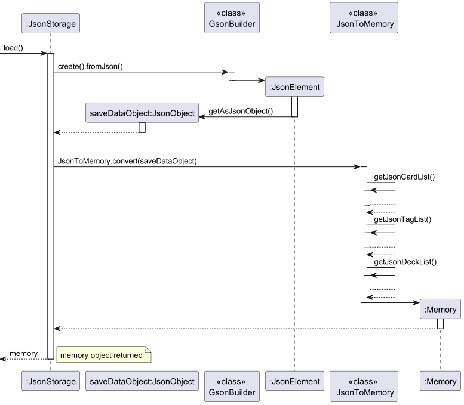
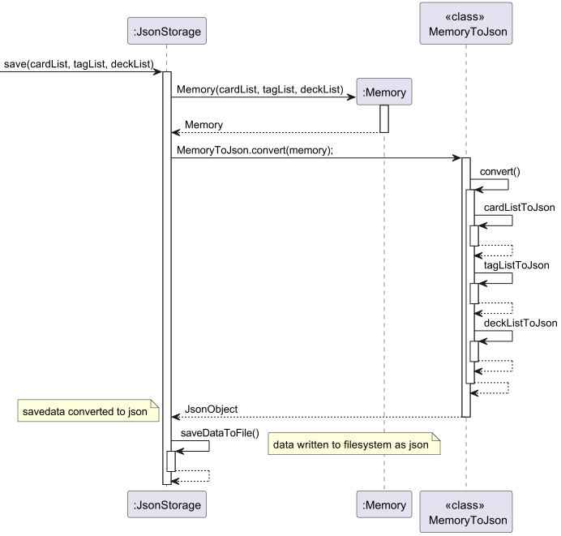
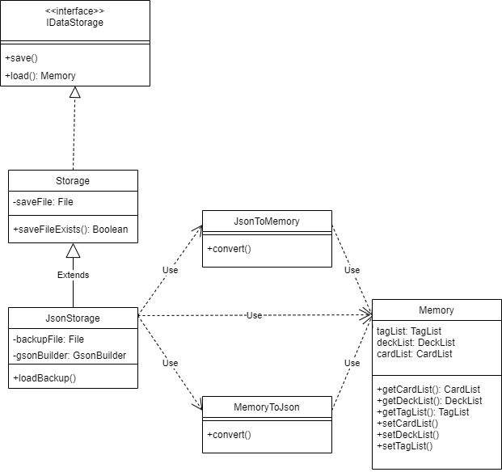

# Ian Teng Yuan Kai - Project Portfolio Page

## Overview

Inka is a CLI-based software that allows users to add Cards containing questions and answers, attach tags into each Card
and put groups of cards into a deck. Inka aims to help students revise for their exam by providing a flashcard-like
experience.

## Summary of Contributions

### Code Contribution
[Reposense Report](https://nus-cs2113-ay2223s2.github.io/tp-dashboard/?search=&sort=groupTitle&sortWithin=title&timeframe=commit&mergegroup=&groupSelect=groupByRepos&breakdown=true&checkedFileTypes=docs~functional-code~test-code~other&since=2023-02-17&tabOpen=true&zFR=false&tabType=authorship&tabAuthor=iantenkai&tabRepo=AY2223S2-CS2113-F10-1%2Ftp%5Bmaster%5D&authorshipIsMergeGroup=false&authorshipFileTypes=docs~functional-code~test-code~other&authorshipIsBinaryFileTypeChecked=false&authorshipIsIgnoredFilesChecked=false)

### Features Implemented

#### 1. Storage - Save/Export

- ***What it is :***
  Stores all of Inka's saved data in a `JsonObject` and writes it to 2 read-only files in the filesystem: `savedata.json` and a hidden `savedata_backup.json`

- ***Value :***
  - Enables app data to persist after the app has been closed, allowing users to pick up from where they have left off.
  - Storing the data in the `Json` format allows the save file to be readable, having the added effect of making debugging easier. 
  - Storing the data as`Json` also lets the function easily adapt to changes to various Classes used in Inka such as `Card` and `DeckList`, allowing new class members to be added during development without disrupting testing.
  - Allows users to transfer their saved data into another computer
  - The hidden backup file introduces redundancy and lets the programme function properly if the original savefile becomes corrupted or is altered.

#### 2. Storage - Load

- ***What it is :***
  Reads a `savedata.json` file in the same directory as Inka to extract the app data stored within it.

- ***Value :***
  - Inka can now extract the relevant fields within the json to reconstruct the `CardList`, `TagList` and `DeckList` objects that store user data.
  - If `savedata.json` is found to be corrupted, the hidden `savedata_backup.json` is loaded instead, letting the programme be more reliable.
#### 3. Abstracted conversion with `MemoryToJson` and `JsonToMemory`

- ***What it is :***
  Operations for converting app data into Json Objects and vice versa are abstracted to be contained within 2 classes

- ***Value :***
    - Storage functions can now more easily adapt to suit changes in Data types required for the app's logic.

    

### Documentation

#### DG contribution

- Add in explanation for Storage feature
- Add Sequence Diagram for `load()`
- Add Sequence Diagram for `save()`
- Add Class Diagram for `storage`

The Sequence Diagram for `load()` is shown here:

The Sequence Diagram for `save()` is shown here:

The class diagram for storage is shown here:

#### UG contribution

Composed the "Faq" section of the UG.

### Team-based Contributions :
- Reproduced and fixed bugs raised during the PE dry-run, including interpreting possible user as in [#118](https://github.com/AY2223S2-CS2113-F10-1/tp/issues/118)
- Conducted the final submission for the project
- Helped clarify intended functionality between members

