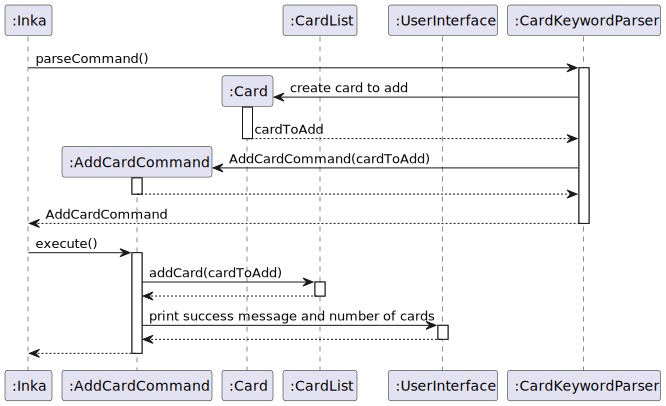

# Wang Silang - Project Portfolio Page

## Overview

Inka is a CLI-based software that allows users to add Cards containing questions and answers, attach tags into each Card
and put groups of cards into a deck. Inka aims to help students revise for their exam by providing a flashcard-like
experience.

## Summary of Contributions

### Features Implemented

#### 1. Parser Version 1

- ***What it is :***
  This is the first parser of Inka, which parses user input with long switch cases. Author also contributed to 
  the writing of several initial commands such as AddCardCommand.

- ***Value :***
  With this parser, Inka v1.0 is able to run, and we could test all of our initial functionalities.

#### 2. Parser Version 2: OptionBuilder

- ***What it is :***
  The `OptionBuilder` class is a part of `Parser` Version 2, which custom builds `Options` object for the Apache Commons CLI parser,
  allowing us to parse flags and their arguments in users' inputs more easily.

- ***Value :***
  Now we can scale the variety of acceptable command line inputs more easily. For example, we can now more easily support Inka to
  take in multi-flag user input, such as `tag edit -o TAG_OLD -n TAG_NEW`.

#### 3. Tag Selector

- ***What it is :***
  The `TagSelector` class has two optional fields, a string for the name of the `Tag` object, and an int for the index of the `Tag`
  object.

- ***Value :*** :
  With `TagSelector`, we can give more freedom to users to choose whether they want to identify the `Tag` object in their command line
  input by its name or index.

### Code Contribution

The code contribution detected and analyzed using RepoSense can be
found [here.](https://nus-cs2113-ay2223s2.github.io/tp-dashboard/?search=Wang&sort=groupTitle&sortWithin=title&timeframe=commit&mergegroup=&groupSelect=groupByRepos&breakdown=true&checkedFileTypes=docs~test-code~other~functional-code&since=2023-02-17&tabOpen=true&tabType=authorship&tabAuthor=JangusRoundstone&tabRepo=AY2223S2-CS2113-F10-1%2Ftp%5Bmaster%5D&authorshipIsMergeGroup=false&authorshipFileTypes=docs~test-code~functional-code&authorshipIsBinaryFileTypeChecked=false&authorshipIsIgnoredFilesChecked=false)

### Team-based tasks :

- Retest the bugs raised during PE dry-run, and flag the possible causes of bugs to facilitate more efficient bug fixing, for example in
  [#110.](https://github.com/AY2223S2-CS2113-F10-1/tp/issues/110)
- Created the skeleton for Developer Guide, and assigned the roles for filling up each part of the Developer Guide.
- Help refactor existing codes to follow software programming principles learnt in class, such as by refactoring
  the `PrintHelpCommand()` to follow Single Responsibility Principle.[#233](https://github.com/AY2223S2-CS2113-F10-1/tp/pull/233)
- Helped teammates using Mac with `checkstyle` issues.

### Documentation

#### User Guide

- Add initial documentations for all the `Tag` features [link](https://github.com/AY2223S2-CS2113-F10-1/tp/pull/91/files) :
- Tidy up the final version of User Guide.

#### Developer Guide

- Add in explanation for card features.

- Add Sequence Diagram for `card add -q QN -a ANS`, `card delete [-i CARDINDEX | -c CARDUUID]` and `card list`.

The Sequence Diagram for `card add -q QN -a ANS` can be found below :

The Sequence Diagram for `card delete [-i CARDINDEX | -c CARDUUID]` can be found below :

The Sequence Diagram for `card list` can be found below :

