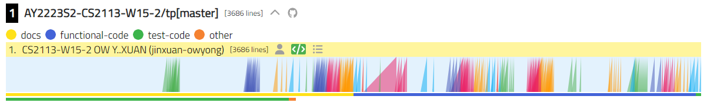
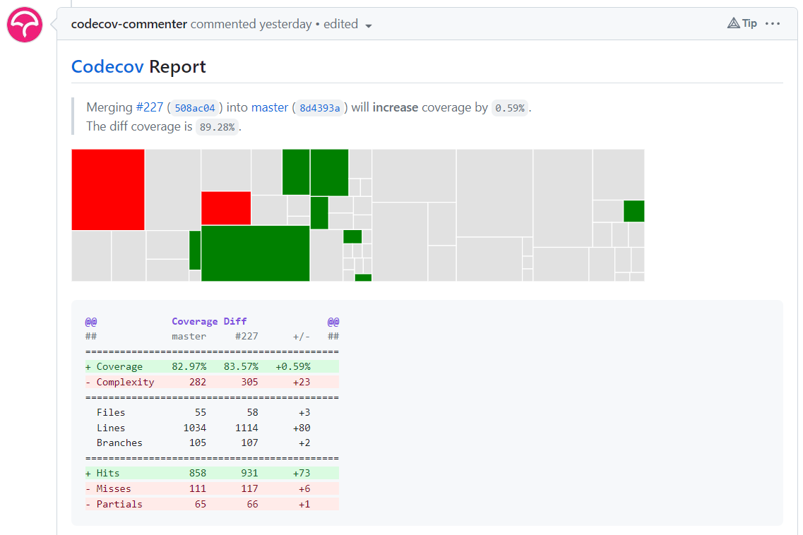

# Jin Xuan Ow Yong - Project Portfolio Page

## Overview
PocketPal is a user-friendly money-management app that makes it easy to track expenses. With a command-line interface, users can quickly log and access their expenses, and categorize them by type. Users can also easily filter expenses based on date, category and price range. Overall, PocketPal is a convenient tool for managing your expenses. 

### Summary of Contributions

Given below are my contributions to the project.

1. Implemented data structure used to perform main application logic (`EntryLog`)
   - What it does: Allows main actions such as add, view, edit and delete to be performed without interfacing with the underlying data structure
   - Highlights: Added filter by amount, query and category methods, which allows method chaining and hence multiple filter conditions. 
     Abstracted underlying data structure used to store entries to simplify CRUD operations
2. Implemented simplified REpresentational State Transfer ([REST](https://en.wikipedia.org/wiki/Representational_state_transfer)) architecture in OOP style
   - What it does: Decouples `Frontend` and `Backend` code by implementing [Client-server model](https://en.wikipedia.org/wiki/Client%E2%80%93server_model). 
     Refactored code from `v1.0` in [#86](https://github.com/AY2223S2-CS2113-W15-2/tp/pull/86).
   - Highlights: Authored `/entry` and `/entries` endpoint which simulates a REST API. Authored classes used for communications between `Frontend` and `Backend`
     ([`pocketpal.communication`](https://github.com/AY2223S2-CS2113-W15-2/tp/tree/master/src/main/java/pocketpal/communication))
   - Credits: [MDN - HTTP](https://developer.mozilla.org/en-US/docs/Web/HTTP)
3. Implemented main application logic in `PocketPal`, `Frontend` and `Backend`
4. Setup logging output to file (`logs/pocketpal.txt`)
5. Authored majority of test code for `*Endpoint`, `Backend`, `Entry` and `EntryLog`

__Code Contributed:__
<a href="https://nus-cs2113-ay2223s2.github.io/tp-dashboard/?search=jinxuan-owyong&breakdown=true&sort=groupTitle%20dsc&sortWithin=title&since=2023-02-17&timeframe=commit&mergegroup=&groupSelect=groupByRepos&checkedFileTypes=docs~functional-code~test-code~other&tabOpen=true&tabType=authorship&tabAuthor=jinxuan-owyong&tabRepo=AY2223S2-CS2113-W15-2%2Ftp%5Bmaster%5D&authorshipIsMergeGroup=false&authorshipFileTypes=docs~functional-code~test-code~other&authorshipIsBinaryFileTypeChecked=false&authorshipIsIgnoredFilesChecked=false">
    Reposense Link 
    
</a>

__Documentation__
- User Guide
  - Frequently Asked Questions
- Developer Guide
  - Added design details, class and sequence diagrams illustrating how application works 
  ([Architecture](https://ay2223s2-cs2113-w15-2.github.io/tp/DeveloperGuide.html#architecture), 
   [`Frontend`](https://ay2223s2-cs2113-w15-2.github.io/tp/DeveloperGuide.html#frontend), 
   [`Backend`](https://ay2223s2-cs2113-w15-2.github.io/tp/DeveloperGuide.html#backend),
   [API](https://ay2223s2-cs2113-w15-2.github.io/tp/DeveloperGuide.html#api),
   [Data Structure](https://ay2223s2-cs2113-w15-2.github.io/tp/DeveloperGuide.html#data-structure),
   [Communication](https://ay2223s2-cs2113-w15-2.github.io/tp/DeveloperGuide.html#communication))
  - Added [glossary](https://ay2223s2-cs2113-w15-2.github.io/tp/DeveloperGuide.html#glossary) definitions for less commonly used terms
  - Added navigation buttons in DG to allow easier manouevrability
  - Reformatted all PlantUML diagrams to follow required style ([f7a2282](https://github.com/AY2223S2-CS2113-W15-2/tp/pull/134/commits/f7a228248f21b2da3f4cf9889076ecc344f62bf9))

__Project Management__

- Setup GitHub team organisation and repository
- Setup GitHub Pages for documentation
- Authored `42` issues, and maintained [issue tracker](https://github.com/AY2223S2-CS2113-W15-2/tp/issues)
- Release management for `v1.0`, `v2.0`, `v2.0.1`, `v2.1`
- Reviewed pull requests 
  ([#26](https://github.com/AY2223S2-CS2113-W15-2/tp/pull/26),
   [#46](https://github.com/AY2223S2-CS2113-W15-2/tp/pull/46),
   [#47](https://github.com/AY2223S2-CS2113-W15-2/tp/pull/47),
   [#48](https://github.com/AY2223S2-CS2113-W15-2/tp/pull/48),
   [#57](https://github.com/AY2223S2-CS2113-W15-2/tp/pull/57),
   [#65](https://github.com/AY2223S2-CS2113-W15-2/tp/pull/65),
   [#155](https://github.com/AY2223S2-CS2113-W15-2/tp/pull/155),
   [#217](https://github.com/AY2223S2-CS2113-W15-2/tp/pull/217),
   [#227](https://github.com/AY2223S2-CS2113-W15-2/tp/pull/227))
- Individual pull request comments can be viewed [here](https://nus-cs2113-ay2223s2.github.io/dashboards/contents/tp-comments.html)

__Community__

- Reported module website bug ([forum/#1](https://github.com/nus-cs2113-AY2223S2/forum/issues/1#issuecomment-1425311756))
- Response to downcasting ([forum/#24](https://github.com/nus-cs2113-AY2223S2/forum/issues/24#issuecomment-1418184124))
- PR reviewed: [#36](https://github.com/nus-cs2113-AY2223S2/tp/pull/36)

__Tools__

- Integrated third-party library (Gson) to the project ([#86](https://github.com/AY2223S2-CS2113-W15-2/tp/pull/86))
- Integrated _Codecov_ to automate tracking of code coverage with GitHub Actions
  ([#110](https://github.com/AY2223S2-CS2113-W15-2/tp/pull/110), [example](https://app.codecov.io/gh/AY2223S2-CS2113-W15-2/tp/pull/231))
  
  
