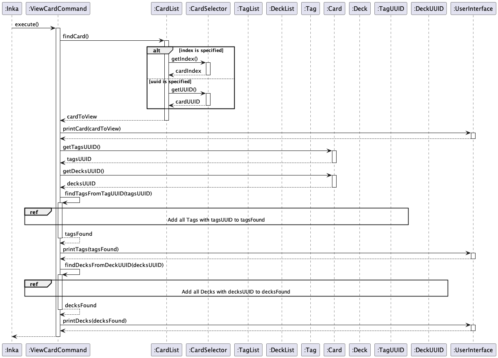

# Mitch Malvin - Project Portfolio Page

## Overview

Inka is a CLI-based software that allows users to add Cards containing questions and answers, attach tags into each Card
and put groups of cards into a deck. Inka aims to help students revise for their exam by providing a flashcard-like
experience.

## Summary of Contributions

### Features Implemented

#### 1. Tag Feature

- ***What it does :***
  This feature allows users to add Tag(s) into their existing Card(s) ,specify the tag name and list all the cards that
  fall under a specific tag. Users are also allowed
  to change the tag name later on if they wish. This feature makes use of the `ArrayList` data structure to store
  the `Tag` in a `TagList`.

This feature consists of a few subfeatures :

- `card tag {-c CARD_UUID | -i CARD_INDEX} -t TAG_NAME ` to attach a tag onto a Card
- `card untag {-c CARDUUID | -i CARD_INDEX} {-t TAGNAME | -x TAG_INDEX}` to remove the tag from a Card
- `tag edit -o OLD_NAME -n NEW_NAME` to edit the name of the Tag
- `tag list` to list all the existing tags
- `tag list [-c CARD_UUID | -i CARD_INDEX]` to list all the Cards that fall under the Tag
- `tag delete {-t TAG_NAME | -x TAG_INDEX}` to remove the Tag from the TagList

- ***Justification :*** This feature is introduced so that users can identify cards that fall under the same topic such
  as `physics`. This feature will make it easier for the user to add cards into the deck
  to be run later as the user simply needs to specify `deck tag -t physics` as opposed to adding the card into the deck
  one by one. This feature also
  allows users to better organize their cards as they can see what are the cards that fall under the tag.

- ***Highlights :*** The most notable thing to keep in mind in this feature is on the importance on ensuring that all
  the data structures in `TagList`, `Tag`,`CardList` and `Card` are properly
  synchronized whenever user enters a tag-related command. This is because most of the classes hold a reference to one
  another, so it is important that we ensure we do not produce any unnecessary bugs by introducing unit tests.

#### 2. Card Feature

More specifically, I contributed to the following features :

`card list`

- ***What it does :*** This feature allows users to have a high level view of all the cards that exist in
  the `CardList`.
  A notable feature that comes with `card list` is its ***truncation*** feature which automatically truncates
  the `question` and `answer` strings in each card if they exceed 50 characters.

- ***Justification :*** This feature is introduced as we foresee that there will be a lot of cards in the `cardList` and
  that it
  might not be user-friendly to overwhelm the users with detailed information at this stage.

With that in mind, another feature that I implemented is :

`card view {-c CAR_DUUID | -i CARD_INDEX}`

- ***What it does :***
  This feature allows users to view what are the `tags` and `decks` that the card is currently associated with. It makes
  use of the
  reference to the `ArrayList` representing `tags` and `decks` inside the `Card` class to ensure that the
  appropriate `tags` and `decks` get displayed.

- ***Justification :*** : This feature is introduced so that users can make sure that their cards already have the
  correct `tags` and `decks`. This is because
  information provided by `card list` does not include the `tags` and `decks` for brevity purposes,
  Additionally, `questions` and `answers` displayed here are no longer truncated
  even when they exceed 50 characters.

### Code Contribution

The code contribution detected and analyzed using RepoSense can be
found [here.](https://nus-cs2113-ay2223s2.github.io/tp-dashboard/?search=&sort=groupTitle&sortWithin=title&timeframe=commit&mergegroup=&groupSelect=groupByRepos&breakdown=true&checkedFileTypes=docs~functional-code~test-code~other&since=2023-02-17&tabOpen=true&tabType=authorship&tabAuthor=mitchmalvin1&tabRepo=AY2223S2-CS2113-F10-1%2Ftp%5Bmaster%5D&authorshipIsMergeGroup=false&authorshipFileTypes=docs~functional-code~test-code&authorshipIsBinaryFileTypeChecked=false&authorshipIsIgnoredFilesChecked=false)

### Team-based tasks :

- Attended and contributed to weekly team meetings.
- Fixed bugs raised during PE-dry-run such as the crucial `InvalidUUIDException`, the detailed list of bugs solved can
  be found
  in [#150.](https://github.com/AY2223S2-CS2113-F10-1/tp/pull/150)
- Contributed to various exception checking and the unit test to ensure that the exception message is appropriate.
- Contributed to the overall architecture of `Inka` such as all the `UUID` classes.
- Contributed to the skeleton code in `Inka` so the `tp` can get started.
- Set up the [AY2223-S2-CS21113-F10-1](https://github.com/AY2223S2-CS2113-F10-1) organization and
  the [tp](https://github.com/AY2223S2-CS2113-F10-1/tp) repository inside.
- Helped create issues in `v1.0` and `v2.0` milestones and close the milestones in a timely manner.
- Helped teammates with `git`  and `checkstyle` issues.
- Reviewed and merged teammates' PRs regularly.

### Documentation

#### User Guide

Add documentations for the following features :

- `card tag {-c CARD_UUID | -i CARD_INDEX} -t TAG_NAME ` to attach a tag onto a Card
- `card untag {-c CARDUUID | -i CARD_INDEX} {-t TAGNAME | -x TAG_INDEX}` to remove the tag from a Card
- `card view {-c CAR_DUUID | -i CARD_INDEX}` to view the card
- `tag edit -o OLD_NAME -n NEW_NAME` to edit the name of the Tag
- `tag list [-c CARD_UUID | -i CARD_INDEX]` to list all the Cards that fall under the Tag
- `tag delete {-t TAG_NAME | -x TAG_INDEX}` to remove the Tag from the TagList
- `tag deck {-t TAG_NAME | -x TAG_INDEX} -d DECK_NAME` to add all the cards that fall under a tag into the dck

#### Developer Guide

- Add Class Diagrams for `CardList` and `TagList`

The Class Diagram for `CardList` can be found below :

The Class Diagram for `TagList` can be found below :

- Add Sequence Diagram for `card view {-c CARDUUID | -i CARDINDEX}`, `card untag {-c CaRDUUID | -t TAGNAME}`
  and `tag list {-c CARDUUID | -i CARDINDEX}`

The Sequence Diagram for `card view {-c CARDUUID | -i CARDINDEX}` can be found below :

The Sequence Diagram for `card untag {-c CaRDUUID | -t TAGNAME}` can be found below :

The Sequence Diagram for `tag list {-c CARDUUID | -i CARDINDEX}` can be found below :

